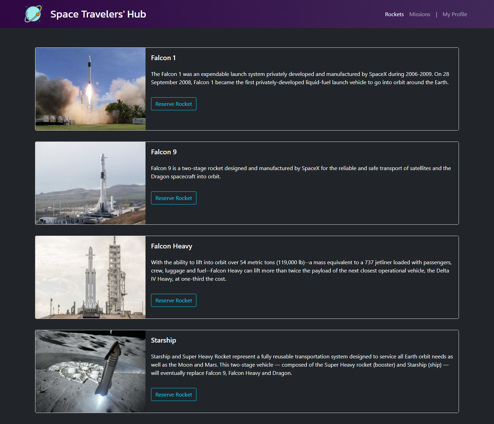

# Space Travelers' Hub 🧑‍🚀

> A web application for a company that provides commercial and scientific space travel services. This application users to book rockets and join selected space missions. Following medium-fidelity wireframe. Created using React, Bootstrap and live data from the SPACEX API.

## Built With

- React
- Redux
- React-Bootstrap

## Live Demo 🚀

[Live Demo Link](https://melaniesigrid.github.io/space_travelers_hub)

## Getting Started

To get a local copy up and running follow these simple example steps.

### Prerequisites
Install Node and npm using the `npm install` command on your command line.

### Setup
Clone this repository by typing `git clone https://github.com/melaniesigrid/space_travelers_hub.git` on your terminal.

### Install
Run `npm install` on your command line.

### Usage
Navigate to the project directory `cd space_travelers_hub`, and run `npm start`.
### Run tests
Run `npm test`.

## Authors

👤 **Melanie Arellano**

- GitHub: [@melaniesigrid](https://github.com/melaniesigrid)
- Twitter: [@SiriMoon11](https://twitter.com/SiriMoon11)
- LinkedIn: [LinkedIn](https://www.linkedin.com/in/melaniesigrid/)

👤 **Daniel Ufeli**

- GitHub: [@danielufeli](https://github.com/danielufeli)
- Twitter: [@danielufeli](https://twitter.com/danielufeli)
- LinkedIn: [LinkedIn](https://www.linkedin.com/in/danielcode/)

## 🤝 Contributing

Contributions, issues, and feature requests are welcome!

Feel free to check the [issues page](../../issues/).

## Show your support

Give a ⭐️ if you like this project!

## Acknowledgments

- Hat tip to all of our partners, colleagues and mentors at Microverse.

## 📝 License

This project is [MIT](./MIT.md) licensed.